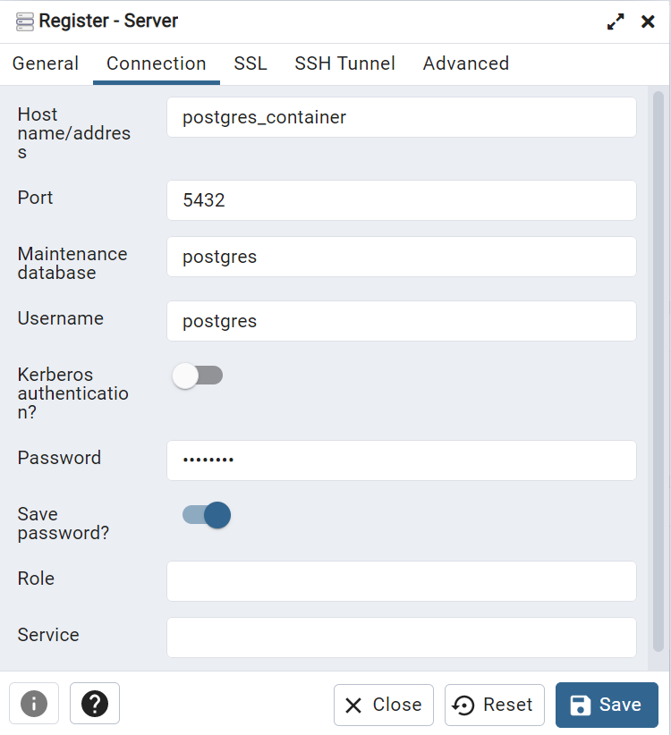

## Installation instructions
Follow the steps:
1. Install [IntelliJ IDEA 2022 (Community Edition)](https://www.jetbrains.com/idea/download)
2. Clone project https://github.com/OstapGonchar/inventory-backend.git
3. Launch IntelliJ and open Project
4. Open File->Project Structure -> Add SDK as on screenshot 
5. Run->Run configurations->Create maven config as on screenshot->Run 
6. In inventory-backend via Terminal call `docker compose up -d` in order to launch DB. 
7. PgAdmin can be accessed via http://localhost:5050/browser/.
8. Register new Server there (name any, but in Connection tab fill in host and password as on screenshot, password is **postgres**):
9. Create new **inventory** database there: 
10. Open file [InventoryApplication](src/main/java/com/inventory/InventoryApplication.java)
11. And click Run (green arrow) as on screenshot 